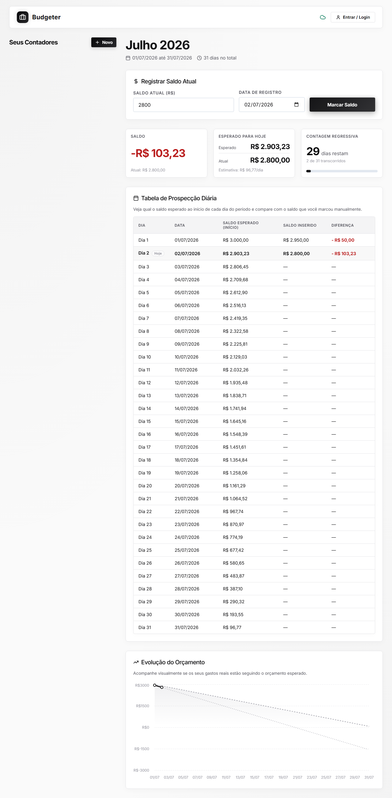

# Budgeter - Contagem Regressiva de Orçamento

> **Nota:** Este é um projeto **Vibe Coded** 🔮✨ construído de forma iterativa com foco na experiência e estética, utilizando inteligência artificial para orquestrar o código.

O **Budgeter** é um aplicativo de planejamento e contagem regressiva financeira minimalista e moderno, projetado em React + TypeScript com Vite e integrado ao Firebase. Ele ajuda usuários a controlarem seus gastos de forma linear ao longo de períodos customizados.



---

## ⚙️ Como o Sistema Funciona

O Budgeter funciona baseado em um princípio simples: **distribuição linear do seu orçamento disponível pelos dias restantes do seu ciclo.**

1. **Definição de Período e Orçamento:** Você insere a data de início e fim do seu ciclo financeiro (ex: mês, quinzena) e a quantia que deseja economizar ou que está disponível para gasto.
2. **Cálculo Diário:** O sistema divide automaticamente o valor total pelo número de dias do período, gerando uma "meta" fixa de gasto/economia por dia.
3. **Acompanhamento de Saldo:** Você pode registrar seu saldo atual a qualquer momento.
4. **Projeção:** A aplicação cruza o saldo atual com a expectativa daquele dia, indicando instantaneamente se você está acima (verde) ou abaixo (vermelho) do planejado.

Os dados são salvos preferencialmente offline-first no navegador (`localStorage`) para velocidade e privacidade, mas podem ser sincronizados na nuvem usando Firebase via Login com o Google.

---

## ✨ Funcionalidades Principais

*   **Contagem Regressiva Visual**: Veja exatamente quantos dias restam e o percentual de tempo decorrido do período.
*   **Estimativa de Gasto Diário**: Calcula de forma automática o limite diário dividindo a redução necessária do orçamento pela quantidade de dias totais.
*   **Prospecção de Saldo Diário**: Mostra qual o saldo ideal que você deve ter ao acordar e ao encerrar o dia de hoje.
*   **Lançamento Rápido de Saldo**: Registre seu saldo atual a qualquer momento do período.
*   **Fórmula de Projeção Fixa**: O saldo atual é usado exclusivamente para indicar se você está acima (economizando) ou abaixo (estourado) da estimativa ideal para aquele dia, sem alterar os cálculos base (garantindo que suas metas originais permaneçam fixas).
*   **Tabela de Prospecção Diária**: Exibe uma listagem completa dia-a-dia do período, destacando o dia atual ("Hoje") com comparação direta de valores e diferença visual (+/-).
*   **Tema Claro Moderno (Alto Contraste)**: Interface limpa e minimalista com contraste reforçado (WCAG Compliant) para máxima legibilidade.
*   **100% Otimizado para Mobile**: Cabeçalhos responsivos que se reorganizam em blocos e tabela de prospecção com rolagem horizontal nativa para evitar cortes em smartphones.

---

## 🔒 Arquitetura de Sincronização & Segurança

*   **Offline-First**: Por padrão, o aplicativo salva e lê todos os períodos localmente no `localStorage` do navegador. Nenhuma conta temporária é gerada no Firebase, economizando recursos e protegendo a privacidade.
*   **Login Exclusivo com o Google**:
    *   **Desktop**: Autenticação limpa via janela pop-up.
    *   **Mobile**: Redirecionamento nativo (`signInWithRedirect`) para contornar bloqueadores de pop-ups em navegadores móveis.
*   **Sincronização Manual**: Ao logar com o Google, o usuário pode clicar em **Enviar dados do navegador para nuvem** para migrar com segurança seus contadores locais para sua conta do Firebase Firestore.

---

## 🛠️ Como Executar Localmente

1.  Instale as dependências do projeto:
    ```bash
    npm install
    ```
2.  Renomeie o arquivo `.env.example` para `.env` e preencha com as credenciais do seu projeto Firebase (obrigatório apenas se quiser habilitar o Login com Google e salvar na nuvem):
    ```env
    VITE_FIREBASE_API_KEY=sua_api_key
    VITE_FIREBASE_AUTH_DOMAIN=seu-app.firebaseapp.com
    VITE_FIREBASE_PROJECT_ID=seu-projeto-id
    VITE_FIREBASE_STORAGE_BUCKET=seu-projeto.appspot.com
    VITE_FIREBASE_MESSAGING_SENDER_ID=seu-sender-id
    VITE_FIREBASE_APP_ID=seu-app-id
    ```
3.  Execute o servidor de desenvolvimento:
    ```bash
    npm run dev
    ```
4.  Abra `http://localhost:5173` no navegador.

---

## 📦 Como Publicar no GitHub

1.  Inicialize o repositório Git (se ainda não o fez):
    ```bash
    git init
    ```
2.  Adicione os arquivos ao stage (o arquivo `.gitignore` impedirá que sua chave secreta `.env` seja enviada):
    ```bash
    git add .
    ```
3.  Crie o commit inicial:
    ```bash
    git commit -m "feat: initial commit - budget countdown dashboard"
    ```
4.  Crie um repositório no GitHub, vincule o repositório remoto e faça o push:
    ```bash
    git branch -M main
    git remote add origin https://github.com/SEU_USUARIO/NOME_DO_REPOSITORIO.git
    git push -u origin main
    ```

---

## ☁️ Como Hospedar no Google Cloud Run

O projeto já inclui um `Dockerfile` de múltiplos estágios otimizado e uma configuração do `nginx.conf` preparada para escutar a variável dinâmica `$PORT` injetada pelo Cloud Run.

### Passo 1: Construir e enviar a Imagem (Google Artifact Registry)
Substitua `PROJECT_ID` pelo ID do seu projeto no Google Cloud e `REPO_NAME` pelo nome do seu repositório de imagens:

```bash
# 1. Autenticar no Google Cloud
gcloud auth login

# 2. Definir o projeto ativo
gcloud config set project PROJECT_ID

# 3. Construir a imagem localmente (ou via Cloud Build)
gcloud builds submit --tag gcr.io/PROJECT_ID/budgeter:latest
```

### Passo 2: Implantar no Cloud Run
Implante o contêiner rodando o comando abaixo. O Cloud Run gerenciará de forma automática a escalabilidade, o certificado SSL (HTTPS) e o tráfego:

```bash
gcloud run deploy budgeter \
  --image gcr.io/PROJECT_ID/budgeter:latest \
  --platform managed \
  --region us-central1 \
  --allow-unauthenticated
```

Durante o deployment, o Cloud Run gerará uma URL pública HTTPS (ex: `https://budgeter-xxxx-uc.a.run.app`).

### Passo 3: Configurar Variáveis de Ambiente no Cloud Run (Injeção de Credenciais)
Você não deve embutir suas credenciais do Firebase na imagem Docker. Em vez disso, injete-as como variáveis de ambiente na implantação do Cloud Run:

1.  Acesse o painel do **Cloud Run** no Google Cloud Console.
2.  Clique no serviço `budgeter` e selecione **Edit & Deploy New Revision** (Editar e implantar nova revisão).
3.  Na aba **Variables & Secrets**, adicione as seguintes chaves de ambiente:
    *   `VITE_FIREBASE_API_KEY`
    *   `VITE_FIREBASE_AUTH_DOMAIN`
    *   `VITE_FIREBASE_PROJECT_ID`
    *   `VITE_FIREBASE_STORAGE_BUCKET`
    *   `VITE_FIREBASE_MESSAGING_SENDER_ID`
    *   `VITE_FIREBASE_APP_ID`
4.  Clique em **Deploy**. O Nginx reiniciará carregando a nova build com os acessos corretos!
